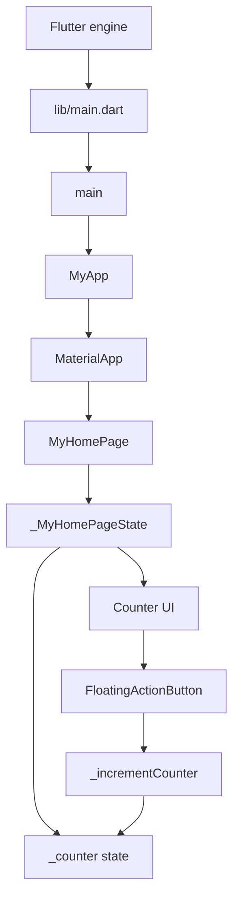

# Budget Tracker Project Context

## Snapshot

- Project type: Flutter application targeting Android, with the standard Flutter platform scaffold present.
- Current maturity: initial scaffold, not yet a budget-tracking product.
- Verified toolchain: Flutter 3.38.5, Dart 3.10.4, DevTools 2.51.1.
- Repository state: no Git commits exist yet; the working tree is untracked from the current workspace perspective.
- Current validation: `flutter test` passes and `flutter analyze` reports no issues.

## Actual Runtime Architecture



The application entry point is `lib/main.dart`. `main()` calls `runApp(const MyApp())`. `MyApp` configures a `MaterialApp` with the title `Flutter Demo`, a seed-based deep-purple Material theme, and `MyHomePage` as the home route. `MyHomePage` owns one local integer state field, `_counter`; pressing the add button increments it through `setState`.

There is currently no budget domain model, transaction model, repository, persistence, authentication, networking, navigation beyond the single home widget, state-management package, or database.

## Important Files

| Path                                                                                 | Responsibility                                                                                                                              |
| ------------------------------------------------------------------------------------ | ------------------------------------------------------------------------------------------------------------------------------------------- |
| `lib/main.dart`                                                                      | Entire current Flutter UI and state. Generated counter sample.                                                                              |
| `test/widget_test.dart`                                                              | One widget smoke test for counter increment behavior.                                                                                       |
| `pubspec.yaml`                                                                       | Package identity, Dart SDK constraint, Flutter SDK dependencies, lint dependency, and Material Icons enablement.                            |
| `pubspec.lock`                                                                       | Resolved dependency versions. Direct hosted dependency currently resolves `cupertino_icons` to 1.0.9 and `flutter_lints` to 6.0.0.          |
| `analysis_options.yaml`                                                              | Includes `flutter_lints`; enables several strict/style rules including single quotes, const usage, no `print`, and sorted pub dependencies. |
| `README.md`                                                                          | Default Flutter starter README; contains no product requirements or domain documentation.                                                   |
| `android/app/src/main/kotlin/com/pongo/budgettracker/budget_tracker/MainActivity.kt` | Thin Android host activity extending `FlutterActivity`.                                                                                     |
| `android/app/src/main/AndroidManifest.xml`                                           | Android launcher activity, Flutter embedding v2 metadata, label, icon, and standard process-text query.                                     |
| `android/app/build.gradle.kts`                                                       | Android application namespace/application ID, Flutter-managed SDK versions, Java/Kotlin 17 targets, and debug signing for release builds.   |
| `android/settings.gradle.kts`                                                        | Loads the Flutter Gradle plugin from the local Flutter SDK; Android Gradle Plugin 8.11.1 and Kotlin Android plugin 2.2.20 are declared.     |

Generated or environment-specific directories such as `.dart_tool/`, `build/`, and `android/.gradle/` should not be treated as source architecture.

## Dependencies

Direct runtime dependencies declared in `pubspec.yaml`:

- `flutter` SDK and `cupertino_icons`
- Drift and `drift_flutter` for database access
- `flutter_riverpod` and `riverpod_annotation` for state management
- `go_router` for routing
- `fl_chart` for charts
- `flutter_local_notifications` and `notification_listener_service` for notifications
- `google_mlkit_text_recognition` for text recognition
- `image_picker` for image input
- `intl` for internationalization/formatting
- `uuid` for identifiers

Direct development dependencies declared in `pubspec.yaml`:

- `flutter_test`, `integration_test`, and `flutter_lints` SDK/package dependencies
- `build_runner` and `drift_dev` for code generation/database development
- `mocktail` for test doubles

These packages are declared, but the current `lib/` and `test/` trees do not yet use them. Do not infer implemented features from dependency declarations alone.

## Test and Quality Workflow

Run from the repository root:

```powershell
flutter pub get
flutter analyze
flutter test
flutter run
```

The existing test builds `const MyApp`, expects `0`, taps `Icons.add`, pumps a frame, and expects `1`. Any product implementation should replace or extend this test with behavior-oriented tests for the chosen budget requirements.

The current analyzer run is clean. Do not interpret the passing counter test as evidence that budget functionality exists.

## Android Notes

- Application ID and namespace: `com.pongo.budgettracker.budget_tracker`.
- Android uses Flutter embedding v2.
- `MainActivity` contains no native business logic.
- Java and Kotlin compilation target version 17.
- Release builds currently use the debug signing configuration, which is suitable for local execution only and must be replaced before publishing.
- SDK versions are delegated to Flutter through `flutter.compileSdkVersion`, `flutter.minSdkVersion`, `flutter.targetSdkVersion`, and `flutter.ndkVersion`.
- `android/local.properties` supplies the local Flutter SDK path and is machine-specific.

## Product/Architecture Gaps

These are not implemented and must be decided before meaningful feature work:

1. Budget domain: accounts, categories, income, expenses, recurring items, budgets, and reporting semantics.
2. Persistence: local-only versus cloud-backed storage, schema, migrations, backup, and export.
3. State management: keep local `setState` for a small screen or introduce a package after domain state appears.
4. Navigation and screen structure.
5. Currency, locale, date/time, and monetary precision rules.
6. Validation, error states, empty states, loading states, and accessibility requirements.
7. Authentication and privacy model if data leaves the device.
8. Android release signing and deployment configuration.

## Safe Starting Point for Another Agent

1. Read this file, `lib/main.dart`, `pubspec.yaml`, and `test/widget_test.dart`.
2. Ask for or derive explicit product requirements before adding infrastructure.
3. Preserve the current green baseline by running `flutter analyze` and `flutter test` after each focused change.
4. Add domain models and tests before building complex screens.
5. Keep platform-specific Android code out of the domain unless a native capability is genuinely required.
6. Do not assume the app has persistence or data migration support; it does not.

## Confidence Boundaries

High confidence: the statements above about files, current widgets, dependencies, Android configuration, and validation results are based on direct inspection and local commands.

Unknown: product requirements, intended user workflows, backend plans, design direction, supported platforms beyond the Android scaffold, and whether the current untracked workspace state is intentional.
